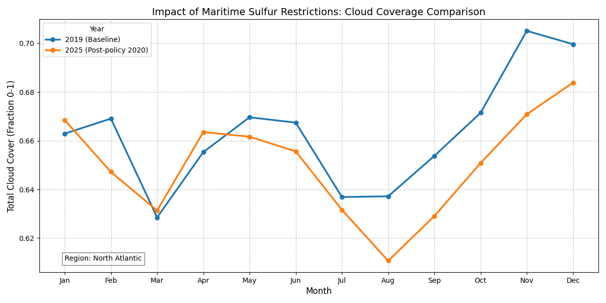

# Examples

```python
import xarray as xr
import xarray_sql as xql

ds = xr.tutorial.open_dataset('air_temperature')

ctx = xql.XarrayContext()
ctx.from_dataset('air', ds, chunks=dict(time=24))

result = ctx.sql('''
  SELECT
    "lat", "lon", AVG("air") as air_avg
  FROM
    "air"
  GROUP BY
   "lat", "lon"
''')

df = result.to_pandas()
df.head()
```

## Cloud Coverage Comparison (ERA5)

This example compares monthly total cloud cover over North America and the North Atlantic
between 2019 (pre-policy baseline) and 2025 (post-IMO 2020 low-sulfur fuel mandate),
using ERA5 reanalysis data queried with xarray-sql.


```python
import xarray as xr
import xarray_sql as xql
import matplotlib.pyplot as plt

ds = xr.open_dataset("era5_dataset.nc", chunks='auto')

# ERA5 longitudes are 0–360 by default; remap to -180–180 for intuitive
# slicing and align with standard geographic conventions
ds = ds.assign_coords(
    longitude = (((ds.longitude + 180) % 360) - 180)
).sortby('longitude')

# Slice North America + North Atlantic for both years
# 2019 = pre-policy baseline; 2025 = post-IMO 2020 sulfur restriction
ds_2019 = ds.sel(latitude=slice(75, 10), longitude=slice(-170, -50), valid_time=slice('2019-01-01', '2019-12-31'))
ds_2025 = ds.sel(latitude=slice(75, 10), longitude=slice(-170, -50), valid_time=slice('2025-01-01', '2025-12-31'))

# Concatenate along the time dimension to create a single dataset
ds_combined = xr.concat([ds_2019, ds_2025], dim='valid_time')

# Align chunks across all variables before passing to xarray-sql,
# which requires consistent chunking
ds_combined = ds_combined.unify_chunks()

ctx = xql.XarrayContext()
ctx.from_dataset("cloud_data", ds_combined)

# Compute monthly average total cloud cover (tcc) grouped by year.
result = ctx.sql('''
SELECT
    year,
    month,
    AVG(tcc) as avg_cloud
FROM (
    SELECT
        EXTRACT(YEAR FROM valid_time) as year,
        EXTRACT(MONTH FROM valid_time) as month,
        tcc
    FROM cloud_data
)
GROUP BY year, month
ORDER BY year, month
''')

df = result.to_pandas()
print(df.head(20))

plot_df = df.pivot(index='month', columns='year', values='avg_cloud')

plt.figure(figsize=(12, 6))
plot_df.plot(kind='line', marker='o', linewidth=2.5, ax=plt.gca())

plt.title('Impact of Maritime Sulfur Restrictions: Cloud Coverage Comparison', fontsize=14)
plt.ylabel('Total Cloud Cover (Fraction 0-1)', fontsize=12)
plt.xlabel('Month', fontsize=12)
plt.xticks(range(1, 13), ['Jan', 'Feb', 'Mar', 'Apr', 'May', 'Jun', 'Jul', 'Aug', 'Sep', 'Oct', 'Nov', 'Dec'])
plt.grid(True, linestyle='--', alpha=0.7)
plt.legend(title='Year', labels=['2019 (Baseline)', '2025 (Post-policy 2020)'])

plt.text(1, plot_df.min().min(), "Region: North Atlantic",
         fontsize=10, bbox=dict(facecolor='white', alpha=0.5))

plt.tight_layout()
plt.show()
```
